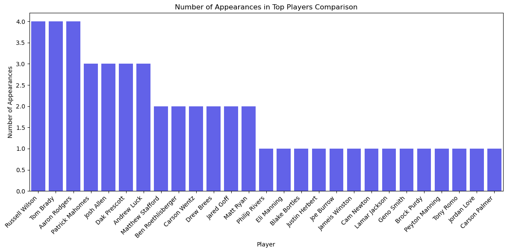
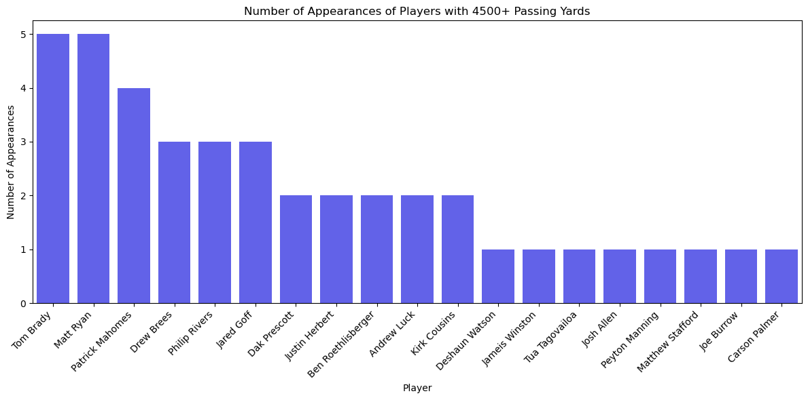
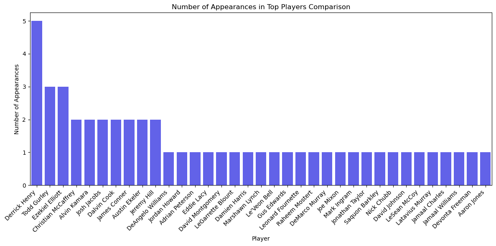
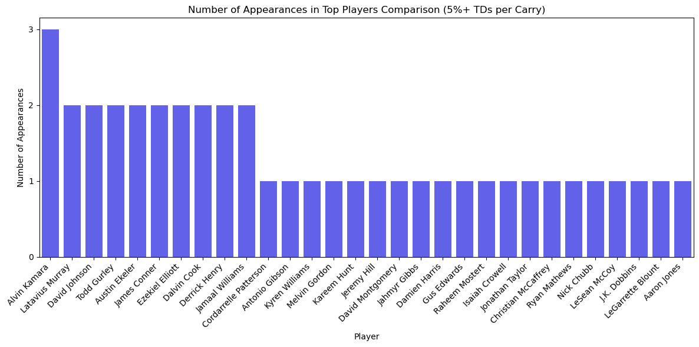
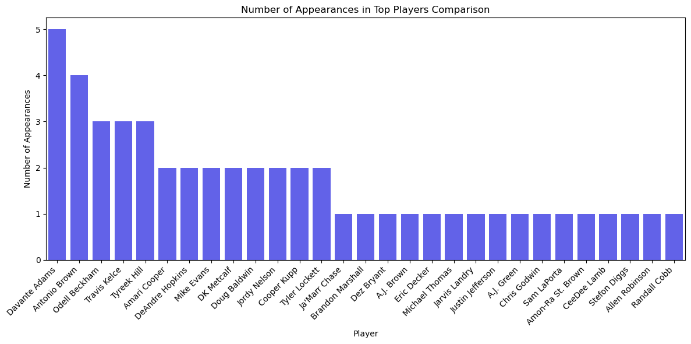
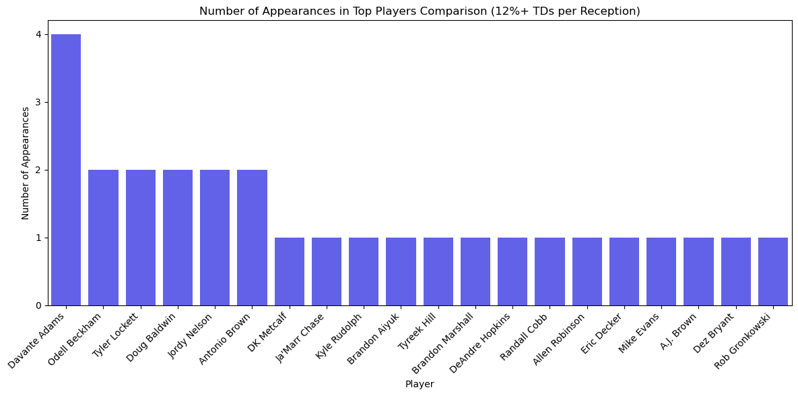

#

# Business Problem
Foxy Sports has been approached by the USA Football organization.

The 2028 Olympic Games will feature, for the first time American Football!

While this will be flag football, weve been asked to scour the NFL for additional candidates to represent our country and do battle for the gold!
#

# The Data
I obtained my data from [nflverse.](https://github.com/nflverse/nflverse-data/releases?page=2)

The nflverse is a set of packages dedicated to data and analysis of the National Football League.79

I load up player_stats.csv which is a comprehensive collection of offensive stats. It contains information about every player that made a play for their offense.

# EDA and Preprocessing

Data exploration was quite thorough. 

i quickly realized that there would be no way to reccomend a defensive or special teams player. without more information in the future this will remain impossible.

I made some season long stats instead of per game and assigned quarterbacks rushers and receivers their own dataframe to make sure i would get the stat that contributes most to each positions success

from here, i was able to drop all but the final game resulting in one row per player with season long stats

finally i drop any unnecessary information and set minimums for passing attempts receptions and carries. this will ensure that we dont see any backup players 

# Modeling

I make a dummy regressor, decision tree, and random forest for each of the three dataframes i created. I also perform a grid search to tune my random forest.

i evaluated each of these using RMSE as it will show me a number closest to zero in the same units as my target. i dont want to be off by more than even one touchdown if possible

Upon running my models i found the key to more touchdowns for Quarterbacks is passing yards. 

i take their total passing touchdowns for every season and visualize the top 5 qbs

i make another chart to log how many times a player appeared in my top 5

then i make one more set of bar graphs with a minimum for season passing yards

i make one last chart to log this set of top players and compare my two top 5 charts

from here you can see for yourself that Patrick Mahomes is the go to guy
similar players include (besides those who are retired) Jared Goff and Justin Herbert 
#
Moving on from here i repeat the above process for Rushers and Receivers
#
For rushers the most important stat is tds per carry

Derrick Henry clearly stands out

Similar players include Alvin Kamara who ranks highest in TPC when healthy but has proven to be injury prone
Austin Ekeler is a bit younger and plays similar to these two 
#
For receivers its tds per reception

Davantae Adams is probably my strongest reccomendation

Younger players similar to him include Ja'Marr Chase and AJ Brown
#
# Conclusions

Target Quarterbacks with high season passing yards, Running Backs with High TDs per carry and Receivers with high TDs per reception. This will ensure that Team USA keeps the gold in LA and brings it home from Brisbane in 2032! 

