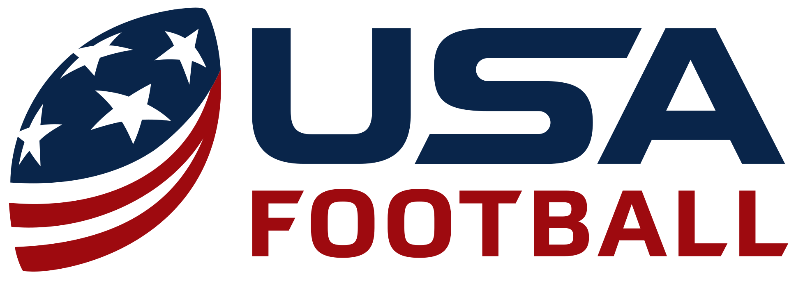

#

# Business Problem
Foxy Sports has been approached by the USA Football organization.

The 2028 Olympic Games will feature, for the first time American Football!

While this will be flag football, weve been asked to scour the NFL for additional candidates to represent our country and do battle for the gold!
#

# The Data
I obtained my data from [nflverse.](https://github.com/nflverse/nflverse-data/releases?page=2)

The nflverse is a set of packages dedicated to data and analysis of the National Football League. The suite of packages is in R however so lets look at it using python! 

I load up player_stats.csv which is a comprehensive collection of offensive stats. It contains information about every player that made a play for their offense. It doesnt tell me who won the game or any defensive stats 

# EDA

Data exploration was quite thorough. i had quite the challenge building defensive stats from the little i could go off of. i ended up just keeping touchdowns against by counting up the touchdowns by game and adding them to the opponent. 

from here i made some season long stats instead of per game and assigned quarterbacks rushers and receivers their own dataframe to make sure i would get the stat that contributes most to each positions success

finally i drop any unnecessary information and set minimums for passing attempts receptions and carries. this will ensure that we dont see any backup players 

# Preprocessing and Modeling

I make a dummy regressor, decision tree, and random forest for each of the three dataframes i created. 

quarterbacks most important key to more touchdowns is passing yards. 

for rushers in tds per carry

and for receivers its tds per reception

my reccomnedations will reflect these stats and touchdowns scored

# Conclusions

coming soon! and visuals!

